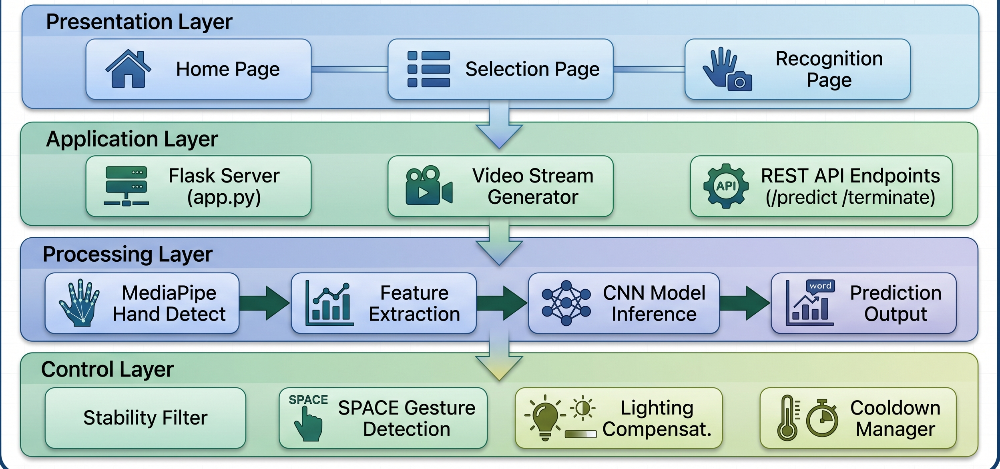

# sign_bridge-Multi-Modle-Sign-Recognition-System
SignBridge: Real-time CNN-based ASL &amp; ISL sign alphabet recognition using MediaPipe hand landmarks. Achieves 99.96% accuracy at &lt;5ms on CPU. Features smart prediction filtering, SPACE gesture detection, voice synthesis, and offline web deployment. No GPU, no internet, just a webcam.
# SignBridge 🖐️🔤


**Real-Time Multi-Modal Sign Alphabet Recognition Using CNN & MediaPipe**

SignBridge is a deep learning-based system that recognizes **American Sign Language (ASL)** and **Indian Sign Language (ISL)** alphabets in real-time using only a standard webcam. No GPU, no internet, no special hardware required.

---
**HOME PAGE**


**SELECTION PAGE**


## 📊 Performance

| Model | Accuracy | Speed | Size |
|-------|----------|-------|------|
| **ASL** | 99.92% | 3.2ms | 0.8 MB |
| **ISL** | 100% | 4.1ms | 4 MB |
| **Combined** | **99.96%** | **<5ms** | **4.8 MB** |

---

## ✨ Features

- 🧠 **CNN Deep Learning** — Custom 25-layer architecture with 210K parameters
- 🖐️ **MediaPipe Hand Tracking** — 21 landmarks per hand in real-time
- 🌐 **Dual Language Support** — ASL + ISL in unified framework
- ⚡ **Real-Time CPU Inference** — <5ms per frame, 25-30 FPS
- 🎯 **Smart Prediction Filter** — 90% confidence + 75% consensus
- ✋ **SPACE Gesture Detection** — Open palm for word separation
- 🔄 **Repeat Letter Support** — Hand-change detection for words like "APPLE"
- 🔊 **Voice Synthesis** — Browser-based text-to-speech (offline)
- 🎨 **CLAHE Lighting Compensation** — Works in dim and bright rooms
- 📴 **100% Offline** — No internet, no cloud, no API keys
- ⌨️ **Keyboard Shortcuts** — Full text editing without mouse
- 🌐 **Web-Based Interface** — Flask server, any browser

---

## 🏗️ Architecture



### CNN Architecture


| Layer Type | Count | Purpose |
|-----------|-------|---------|
| Conv2D | 5 | Spatial pattern detection |
| BatchNormalization | 8 | Training stability |
| MaxPooling2D | 2 | Dimension reduction |
| Dropout | 6 | Overfitting prevention |
| GlobalAvgPooling | 1 | 2D → 1D conversion |
| Dense | 3 | Classification |
| **Total** | **25** | **210,938 parameters** |

---

## 📁 Project Structure

 signbridge/
├── app.py # Flask server & API endpoints
├── model_manager.py # CNN loading & prediction pipeline
├── train_complete.py # Model training script
├── requirements.txt # Python dependencies
├── saved_models/
│ ├── asl_classifier.keras # ASL trained model
│ └── isl_classifier.keras # ISL trained model
├── templates/
│ ├── index.html # Home page
│ ├── selection.html # Mode selection
│ └── recognition.html # Live recognition interface
├── static/
│ ├── style_home.css
│ ├── style_selection.css
│ ├── style_recognition.css
├──assets
│   └── images/
|       ├── home page.png
│       └── selection page.png
|       |__ architecture.png
|       |__ cnn architecture.png
├── plots/ # Training visualizations
└── reports/ # Training reports


---

## 🚀 Quick Start

### Prerequisites

- Python 3.10 (64-bit)
- Anaconda Navigator (recommended)
- Webcam (built-in or USB)
- 4GB RAM minimum

### Installation

```bash
# Clone the repository
git clone https://github.com/yourusername/signbridge.git
cd signbridge

# Create virtual environment
conda create -n signbridge python=3.10 -y
conda activate signbridge

# Install dependencies
pip install -r requirements.txt

Run the Application

python app.py


📖 Usage Guide

Open http://localhost:5000 in your browser

Click "Initialize System" on the home page

Select ASL or ISL mode

Show your hand sign to the camera

Hold the gesture steady for ~0.5 seconds

Letter appears in the text console

Open palm → Space between words

Click Speak or press Enter → Text read aloud

🧠 How It Works

Camera Capture — OpenCV captures frames at 640×480 @ 30 FPS

Hand Detection — MediaPipe extracts 21 landmarks (x, y, z) per hand

Feature Normalization — All coordinates normalized relative to wrist

CNN Inference — 63/126 features → 25-layer CNN → 26 probabilities

Smart Filtering — Consensus check → Confidence threshold → Output

SPACE Detection — Geometric rules detect open palm for spacing


📈 Results

ASL Model
Test Accuracy: 99.92%

F1-Score (Weighted): 99.92%

16 letters at 100% F1-Score

All letters > 99.5% F1

ISL Model
Test Accuracy: 100%

F1-Score (Weighted): 100%

All 26 letters at 100% F1

🛠️ Tech Stack
Technology	Version	Purpose
Python	3.10	Core language
TensorFlow/Keras	2.12.0	Deep learning
MediaPipe	0.10.5	Hand tracking
OpenCV	4.8.0	Video processing
Flask	2.2.5	Web server
NumPy	1.23.5	Numerical computing
Scikit-learn	1.3.2	ML utilities

📋 Requirements

tensorflow==2.12.0
mediapipe==0.10.5
opencv-python==4.8.0
flask==2.2.5
numpy==1.23.5
scikit-learn==1.3.2
protobuf==3.20.3
matplotlib==3.7.4
seaborn==0.12.2
h5py==3.9.0
tqdm==4.66.1
Pillow==9.5.0

🎯 Applications

🏥 Healthcare — Patient-doctor communication

🏫 Education — Classroom participation

🏦 Banking — Independent transactions

🏢 Government — Filing complaints

🛒 Daily Life — Shopping, dining, travel

💼 Workplace — Interviews, meetings

🔮 Future Work

□ Dynamic gesture recognition (LSTM/TCN)
□ Mobile/edge deployment optimization
□ Video calling integration
□ User personalization & calibration
□ Extended sign language support (BSL, Auslan)
□ Word prediction using language models

📄 License

This project is licensed under the MIT License - see the LICENSE file for details.

🙏 Acknowledgments

Google MediaPipe Team for hand tracking framework

TensorFlow/Keras for deep learning tools

Prathum Arikeri for ISL dataset

All open-source contributors

